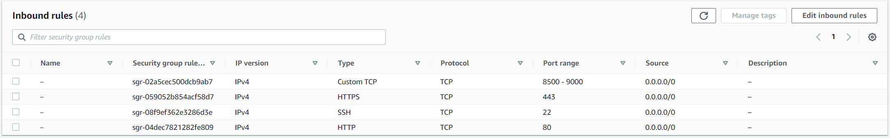

# Document Classification Application

This Python application is a document classification tool that utilizes Large Language Models (LLM) on Amazon Bedrock to classify various documents through in-context learning. The application allows users to upload PDF or image files and classify the content of these files into predefined labels or categories.

## Features

- **File Upload**: Users can upload PDF or image files through the Streamlit interface.
- **Document Processing**: The application handles the upload and processing of PDF and image files, including converting PDF files into individual image pages (to be used with Claude3 Vision).
- **Text Extraction**: For PDF and image files, the application uses Amazon Textract to extract the text content from the documents. The extracted text is cached in an Amazon S3 bucket for future use.
- **Document Classification**: Users can provide a manifest file containing a list of possible labels or categories for the documents. The application prompts the selected Claude language model with the extracted text and the list of possible labels, and the model generates a response classifying the document content into one or more of the provided labels.
- **Model Selection**: The application supports various Claude models, including `claude-3-sonnet`, `claude-3-haiku`, `claude-instant-v1`, `claude-v2`, and `claude-v2:1`. Users can select the desired model through the Streamlit sidebar.
- **Cost Calculation**: The application calculates and displays the cost of using the selected model based on input and output token pricing defined in the `pricing.json` file.
- **Caching and Persistence**: The application caches the extracted text and Textract results in the S3 bucket to avoid redundant processing. 

## To run this Streamlit App on Sagemaker Studio follow the steps below:

* Set up the necessary AWS resources:
   - [Create an S3 bucket](https://docs.aws.amazon.com/AmazonS3/latest/userguide/create-bucket-overview.html) (if not already have one) to store uploaded documents and Textract output.

## Configuration
The application's behavior can be customized by modifying the `config.json` file. Here are the available options:

- `Bucket_Name`: The name of the S3 bucket used for caching documents and extracted text.
- `max-output-token`: The maximum number of output tokens allowed for the AI assistant's response.
- `bedrock-region`: The AWS region where the Bedrock runtime is deployed.
- `s3_path_prefix`: The S3 bucket path where uploaded documents are stored (without the trailing foward slash). 
- `textract_output`: The S3 bucket path where the extracted content by Textract are stored (without the trailing foward slash). 

* Update the `pricing.json` file with the latest pricing information for the [Claude models on Amazon Bedrock](https://aws.amazon.com/bedrock/pricing/).

If You have a sagemaker Studio Domain already set up, ignore the first item, however, item 2 is required.
* [Set Up SageMaker Studio](https://docs.aws.amazon.com/sagemaker/latest/dg/onboard-quick-start.html) 
* SageMaker execution role should have access to interact with [Bedrock](https://docs.aws.amazon.com/bedrock/latest/userguide/api-setup.html), [Textract](https://docs.aws.amazon.com/aws-managed-policy/latest/reference/AmazonTextractFullAccess.html)
* [Launch SageMaker Studio](https://docs.aws.amazon.com/sagemaker/latest/dg/studio-launch.html)
* [Clone this git repo into studio](https://docs.aws.amazon.com/sagemaker/latest/dg/studio-tasks-git.html)
* Open a system terminal by clicking on **Amazon SageMaker Studio** and then **System Terminal** as shown in the diagram below
* 
* Navigate into the cloned repository directory using the `cd` command and run the command `pip install -r req.txt` to install the needed python libraries
* Run command `python3 -m streamlit run classifier.py --server.enableXsrfProtection false --server.enableCORS  false` to start the Streamlit server. Do not use the links generated by the command as they won't work in studio.
* To enter the Streamlit app, open and run the cell in the **StreamlitLink.ipynb** notebook. This will generate the appropiate link to enter your Streamlit app from SageMaker studio. Click on the link to enter your Streamlit app.
* **⚠ Note:**  If you rerun the Streamlit server it may use a different port. Take not of the port used (port number is the last 4 digit number after the last : (colon)) and modify the `port` variable in the `StreamlitLink.ipynb` notebook to get the correct link.

To run this Streamlit App on AWS EC2 (I tested this on the Ubuntu Image)
* [Create a new ec2 instance](https://docs.aws.amazon.com/AWSEC2/latest/UserGuide/EC2_GetStarted.html)
* Expose TCP port range 8500-8510 on Inbound connections of the attached Security group to the ec2 instance. TCP port 8501 is needed for Streamlit to work. See image below
* 
* [Connect to your ec2 instance](https://docs.aws.amazon.com/AWSEC2/latest/UserGuide/AccessingInstances.html)
* Run the appropiate commands to update the ec2 instance (`sudo apt update` and `sudo apt upgrade` -for Ubuntu)
* Clone this git repo `git clone [github_link]`
* Install python3 and pip if not already installed
* EC2 [instance profile role](https://docs.aws.amazon.com/IAM/latest/UserGuide/id_roles_use_switch-role-ec2_instance-profiles.html) has the required permissions to access the services used by this application mentioned above.
* Install the dependencies in the requirements.txt file by running the command `sudo pip install -r req.txt`
* Run command `tmux new -s mysession`. Then in the new session created `cd` into the **ChatBot** dir and run `python3 -m streamlit run classifier.py` to start the streamlit app. This allows you to run the Streamlit application in the background and keep it running even if you disconnect from the terminal session.
* Copy the **External URL** link generated and paste in a new browser tab.
To stop the `tmux` session, in your ec2 terminal Press `Ctrl+b`, then `d` to detach. to kill the session, run `tmux kill-session -t mysession`

## Usage

1. Launch the Streamlit application in your web browser.
2. In the sidebar, select the desired Claude model and specify whether you want to classify labels per page or for the entire document.
3. Upload a manifest file containing the list of possible labels and their descriptions.
4. Upload the PDF or image files you want to classify.
5. Click the "Classify" button to initiate the classification process.
6. The application will display the classification results and the cost associated with using the selected model.

## Contributing

Contributions to this project are welcome. If you find any issues or have suggestions for improvements, please open an issue or submit a pull request.

## License

This project is licensed under the [MIT License](LICENSE).
